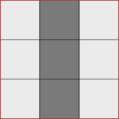
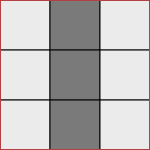
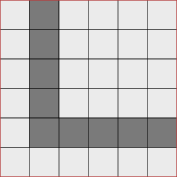

# Maze Tiles

[](https://travis-ci.org/marcbreitung/maze-tiles-rust)

A maze contains multiple tiles (red outline), each tile is divided into fields (black outline), which can be walkable. 

## Tile 

The ``tile::Tile`` is the basic unit for the maze.



```rust
let tile = Tile::new(Position::new(1, 2), Field::Ground);
```

## Tile Group

The ``tile_group::TileGroup`` is a group of multiple ``tile::Tile`` items.



```rust
let fields = vec![
    Field::Ground, Field::Path, Field::Ground,
    Field::Ground, Field::Path, Field::Ground,
    Field::Ground, Field::Path, Field::Ground,
];
let tile_group = TileGroup::new(Position::new(0, 1), Size::new(3, 3), fields);
```

## Maze

The ``maze::Maze`` is holds all ``tile::Tile`` items.



```rust
let mut maze = Maze::new(6, 6);
let tile = Tile::new(Position::new(0, 0), Field::Ground);
maze.add_tile(tile);
assert_eq!(maze.tiles.contains_key(&Position::new(0, 0)), true);
```